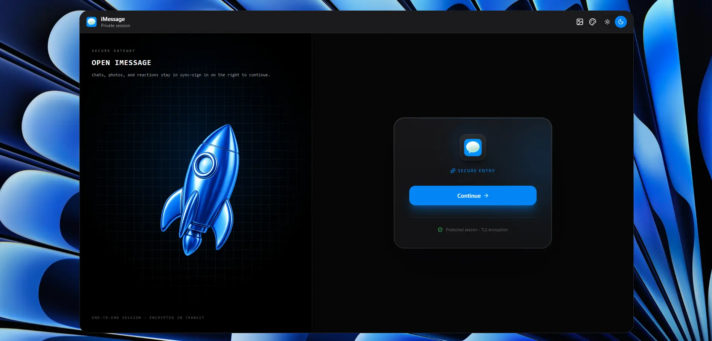

# iMessage App

<p align="center">
  
</p>

A full-stack real-time messaging application inspired by Apple's iMessage experience. Built with modern web technologies, this project features authentication, real-time communication, media sharing, and a responsive user interface.

> This project was originally built by following a crash course tutorial and has since been customized and enhanced with a TypeScript-first architecture, improved project structure, and modern developer tooling including Biome for linting and formatting.

## ✨ Features

* 🔐 Secure authentication with Clerk
* 💬 Real-time messaging with Socket.IO
* 🖼️ Image sharing and media uploads
* 👤 User profile management
* 🟢 Online user presence
* 🌐 Multilingual support with i18next (language detection & HTTP backend)
* 📱 Responsive and modern UI
* ⚡ Fast frontend powered by Vite
* 🎨 Beautiful components using HeroUI
* 🔄 Global state management with Zustand
* 🛡️ Fully typed codebase with TypeScript
* 🧹 Consistent code quality with Biome
* 🔀 Client-side routing with React Router v7
* 🧩 Utility-first styling with Tailwind CSS, clsx, and tailwind-merge
* 🔌 API communication via Axios

## 🛠️ Tech Stack

### Frontend

* React 19
* TypeScript
* Vite
* React Router v7
* HeroUI
* Tailwind CSS v4
* clsx
* tailwind-merge
* Zustand
* Socket.IO Client
* Clerk Authentication (@clerk/react)
* Axios
* i18next
* react-i18next
* i18next-browser-languagedetector
* i18next-http-backend
* Lucide React
* React Hot Toast

### Backend

* Node.js
* Express.js v5
* TypeScript
* MongoDB
* Mongoose
* Socket.IO
* Clerk Express SDK
* ImageKit
* Multer
* Cron Jobs
* CORS
* dotenv

### Development Tools

* Biome (Linting & Formatting)
* TypeScript Compiler
* TSX
* Babel React Compiler
* Git & GitHub

## 🚀 Getting Started

### Prerequisites

Make sure you have installed:

* Node.js (v20+ recommended)
* npm
* MongoDB

### Clone the Repository

```bash
git clone https://github.com/your-username/imessage-app.git

cd imessage-app
```

## ⚙️ Environment Variables

### Backend

Create a `.env` file inside the `backend` directory:

```env
PORT=5000

MONGODB_URI=your_mongodb_connection_string

CLERK_PUBLISHABLE_KEY=your_clerk_publishable_key
CLERK_SECRET_KEY=your_clerk_secret_key

IMAGEKIT_PUBLIC_KEY=your_imagekit_public_key
IMAGEKIT_PRIVATE_KEY=your_imagekit_private_key
IMAGEKIT_URL_ENDPOINT=your_imagekit_url_endpoint
```

### Frontend

Create a `.env` file inside the `frontend` directory:

```env
VITE_CLERK_PUBLISHABLE_KEY=your_clerk_publishable_key
VITE_API_URL=http://localhost:5000
```

## 📦 Installation

### Install Frontend Dependencies

```bash
cd frontend
npm install
```

### Install Backend Dependencies

```bash
cd backend
npm install
```

## 🏃 Running the Application

### Start Backend

```bash
cd backend

npm run dev
```

### Start Frontend

```bash
cd frontend

npm run dev
```

The application should now be available at:

```text
Frontend: http://localhost:5173
Backend:  http://localhost:5000
```

## 🧹 Code Quality

This project uses **Biome** for maintaining code consistency and formatting.

Format the codebase:

```bash
npx biome format --write .
```

Run linting checks:

```bash
npx biome check .
```

## 🔄 Real-Time Functionality

Real-time features are powered by Socket.IO and include:

* Instant message delivery
* Online/offline user status
* Live conversation updates
* Real-time synchronization across clients

## 🎓 Learning Resource

This project was initially developed by following the following crash course tutorial:

**MERN Stack Project: Realtime Chat App Tutorial - React.js & Socket.io 2026** by Codesistency

[https://www.youtube.com/watch?v=7-aY-tS2LhE&t=14502s](https://www.youtube.com/watch?v=7-aY-tS2LhE)

The tutorial served as a foundation for learning and implementation. However, this repository contains significant modifications and improvements, including:

* Migration to TypeScript
* Refactored project architecture
* Integration of Biome
* Updated dependencies and tooling
* Custom code organization
* Additional type safety improvements

## 📄 License

This project is intended for educational, learning, and portfolio purposes.

Please review the licenses of all third-party services and libraries used within this project.

---

Built with ❤️ using React, TypeScript, Express, MongoDB, Socket.IO, Clerk, and HeroUI.
